# iOS 行情面板框架简介

### 行情面板类型
华尔街见闻的行情面板主要分为三种类型，A股面板，外汇面板，单点数据面板。

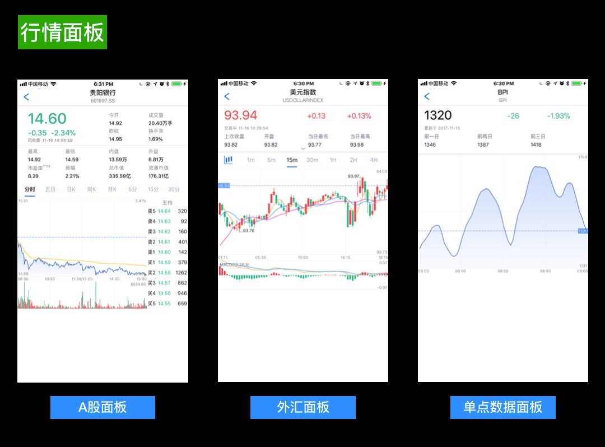

### 图表类型
通过LNChart能绘制的主要图表类型。

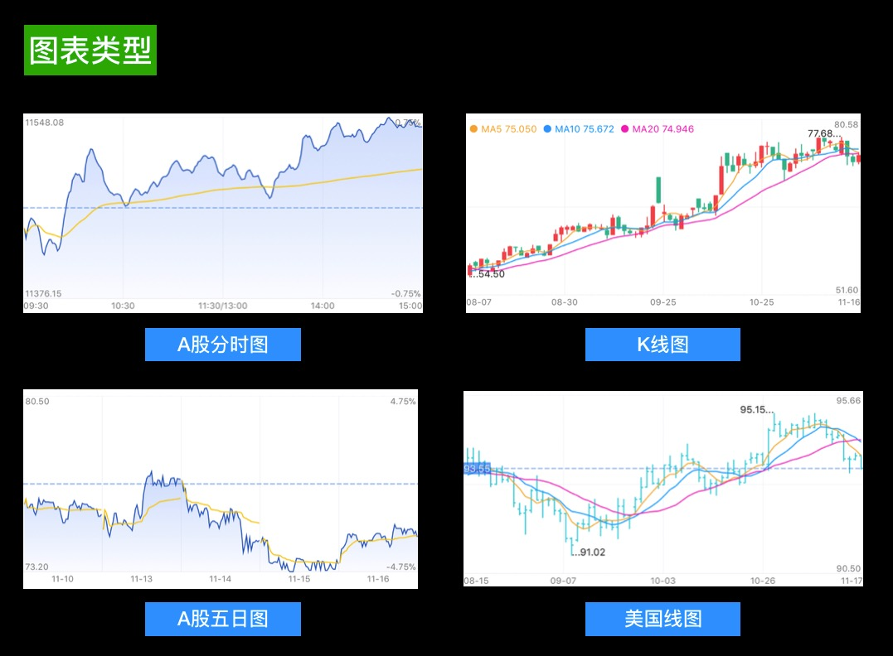
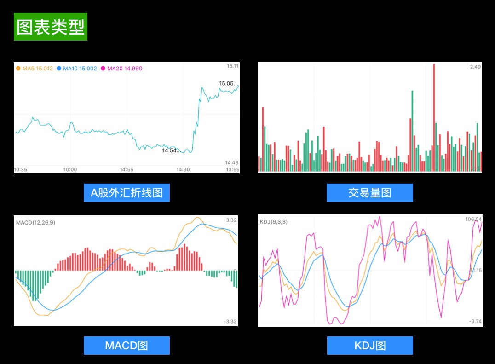
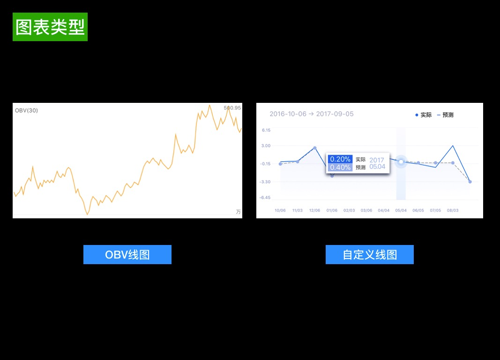

### 架构组成
行情面板的主要组成。

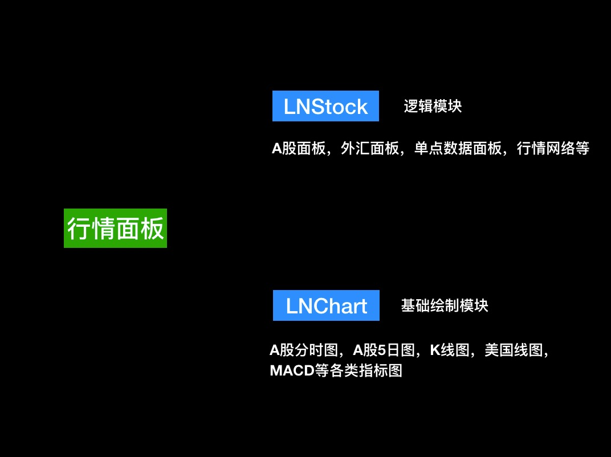

## LNChart简介
图标的绘制一般有两种方式，一种是在原生`UIScrollview`绘制，一种是在View上直接绘制。比如像`雪球`，`MetaTrader5`等是在原生的`UIScrollview`绘制。`自选股`,`富途牛牛`等是在View上直接绘制。

在原生`UIScrollview`绘制优点是整体结构相对简单，交互不需要额外处理，动画相对平滑。缺点交互有局限性，做不到一些交互体验。而View上直接绘制可以自定义动画函数，比较精确的控制显示与交互。但是实现交互相对复杂。

下列为常见APP图层构成
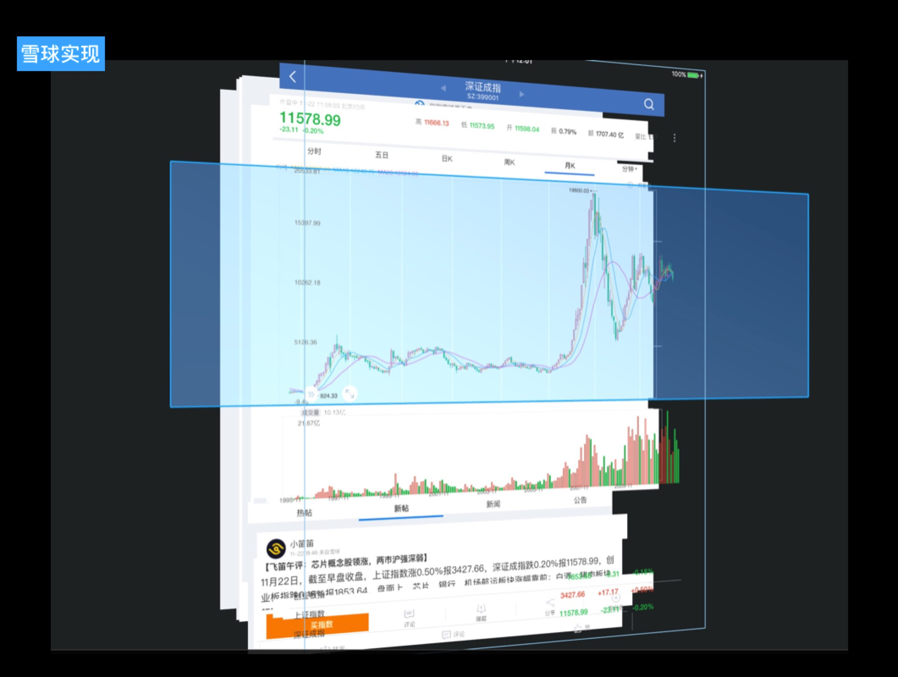
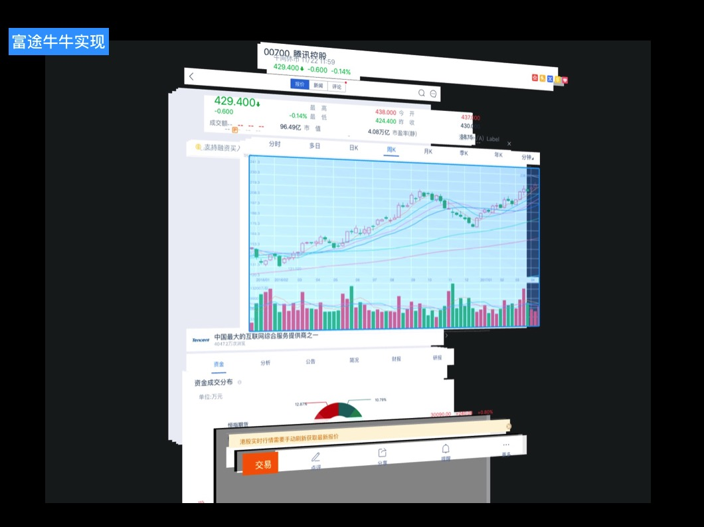
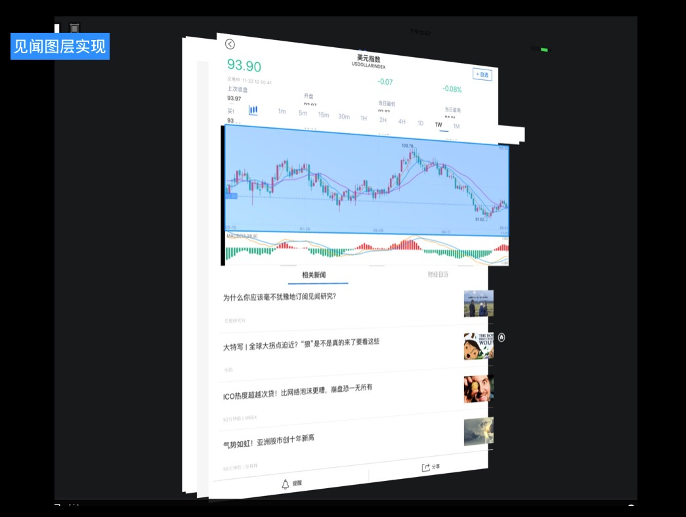

## LNChart结构
LNChart主要分为5个部分，`ChartRender`主要的绘制类，`Components`基础控件类，`Model`数据和设置类，`Utils`工具相关类，`View`视图类。详细构成如下表。

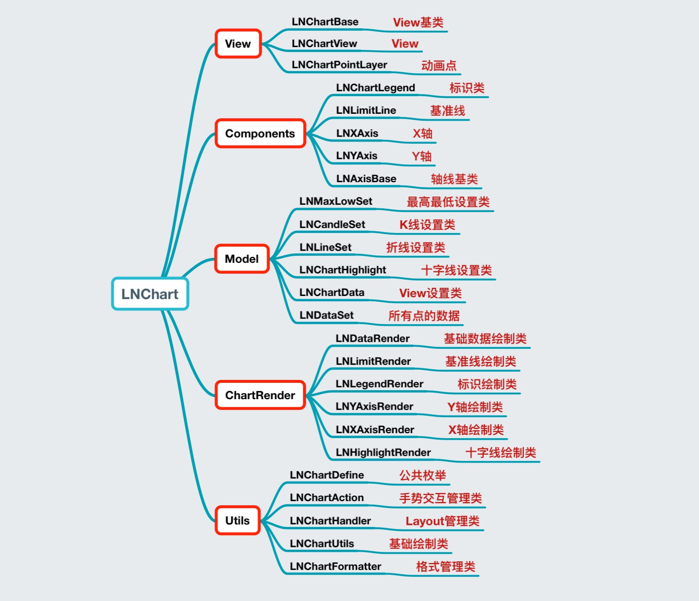

## 图标绘制
#### 视图初始化顺序：

#### 视图绘制顺序：

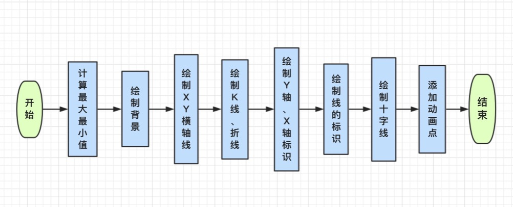

#### 图表的数据处理：
第一部分，通过图表类型，来计算图表的最大最小值。
第二部分，在绘制时候把相应的数据转化成点位坐标值。

#### 绘制性能处理：
数据分开计算，只会计算当前屏幕能展示的点。
简化代码结构，避免多次计算。

## 交互处理
#### 长按交互
给视图添加长按手势，长按获取当前位置并通过当前K线大小计算转化成下标，并记录。
#### 拖动交互
给视图添加Pan手势，通过滑动距离和时间计算速率，动态改变起始下标来达到动画效果。

滑动使用的动画函数
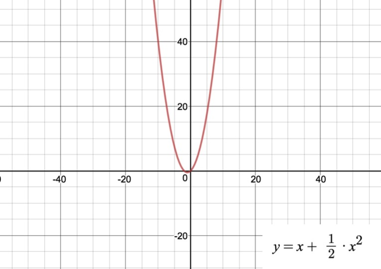

#### 缩放交互
给视图添加缩放手势，并通过放大缩小的倍数来转化K线的宽度计算出增加或减少的个数，通过个数改变起始位置的值。

## 其他
#### 容错判断
添加对数据点判断，来防止奔溃或者跳过数据点绘制。
#### 上面板与下面板互动
上下视图通过Block来传递必要的信息（开始结束下标，长按下标等)。

